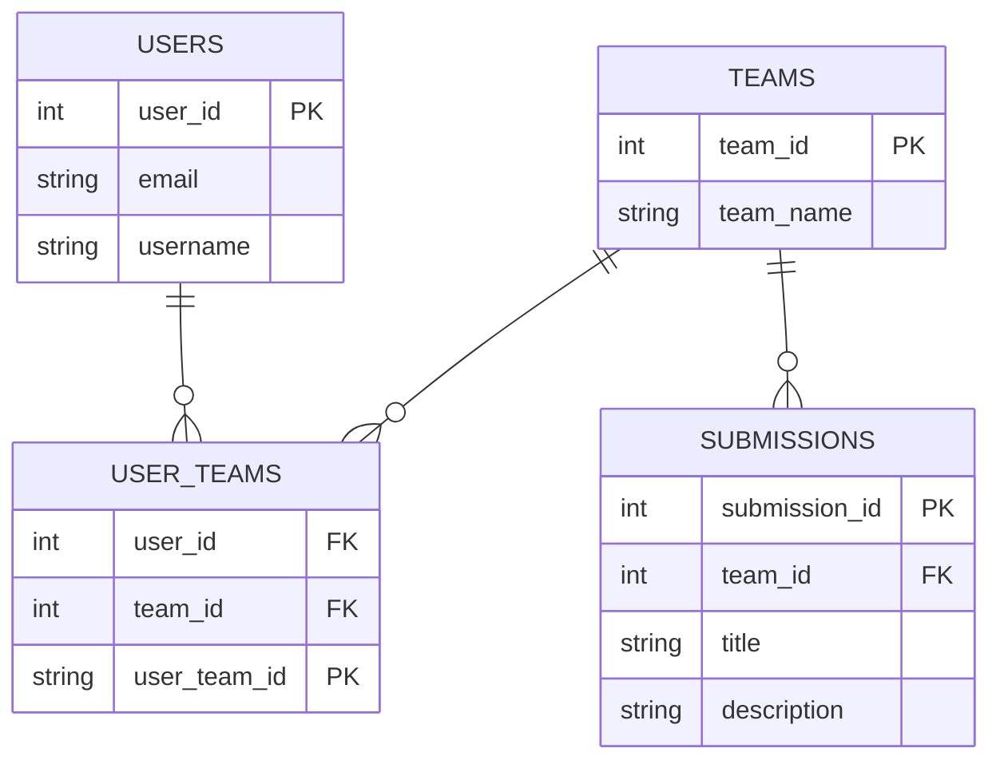

```mermaid
erDiagram
    USERS ||--o{ USER_TEAMS : ""
    TEAMS ||--o{ USER_TEAMS : ""
    TEAMS ||--o{ SUBMISSIONS : ""

    USERS {
        int user_id PK
        string email
        string username
    }

    TEAMS {
        int team_id PK
        string team_name
    }

    USER_TEAMS {
        int user_id FK
        int team_id FK
        string user_team_id PK
    }

    SUBMISSIONS {
        int submission_id PK
        int team_id FK
        string title
        string description
    }
```
